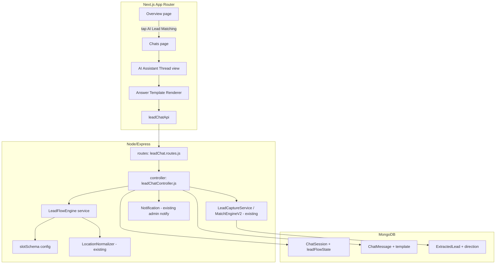
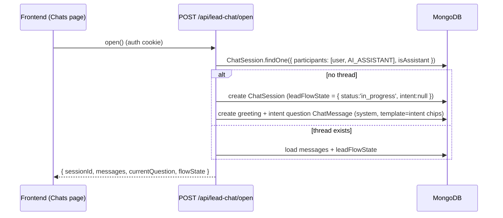
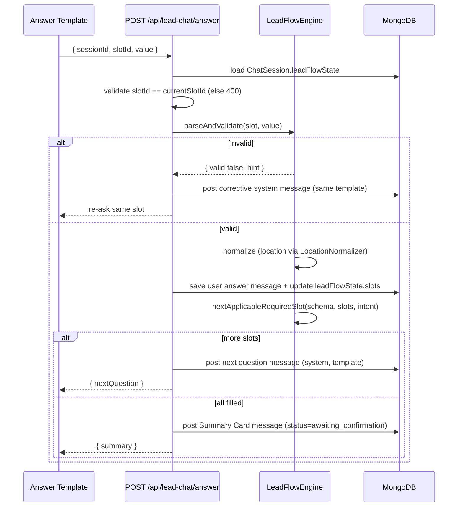
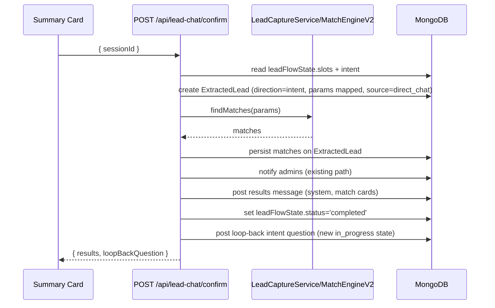

# Design Document: AI Lead Matching (Conversational Slot-Filling Chat)

## Overview

AI Lead Matching gives Users a chat-based, conversational way to capture a property lead. Selecting "AI Lead Matching" on the Overview page opens a persistent AI Assistant chat thread. The assistant asks one question at a time using tappable answer templates; the answers fill a declarative Slot Schema; on confirmation the captured data becomes an `ExtractedLead` and is run through the existing `MatchEngineV2` so the User sees matches immediately, inside the same chat.

The conversation engine is a deterministic rule/state machine (Approach A) — there is no external LLM or generative AI, no new paid service, and no data leaves the platform. "AI" refers to the conversational UX plus the existing matching intelligence.

Design strategy is deliberately additive and reuse-first:
- Reuse `ChatSession` / `ChatMessage` for the thread and its messages (assistant messages use the existing `messageType: 'system'`).
- Reuse `ExtractedLead` as the output record (add one `direction` field).
- Reuse `MatchEngineV2`, `LocationNormalizer`, and the existing admin-notification path (as used by `LeadCaptureService`).
- Add a small `LeadFlowEngine` service (the Question Engine), a declarative slot schema, and a thin controller/routes layer.

The conversation uses "Option 1": one persistent Assistant Thread per User; after a lead completes, the assistant loops back to the intent question for the next lead in the same thread.

---

## Architecture



### Key idea: everything is a chat message

The assistant's questions, the Summary Card, and the results are all `ChatMessage` documents with `messageType: 'system'` authored by the reserved AI Assistant identity. Question messages carry a `template` object describing the input control to render. The User's answers are normal `ChatMessage` documents. This makes the whole conversation naturally persistent, resumable, and viewable through the existing chat rendering, with only additive schema fields.

---

## Sequence Diagrams

### Open / Resume the Assistant Thread



### Answer a slot → next question



### Confirm → persist lead → match → results → loop back



---

## Components and Interfaces

### Backend Component 1: LeadFlowEngine (new service)

**Purpose:** Pure, deterministic Question Engine. Given the Slot Schema, the current filled slots, and the intent, it decides the next question, validates answers, and reports completion. No DB access, no side effects — fully unit-testable.

**Location:** `HIT_Backend/services/LeadFlowEngine.js`

**Interface (conceptual):**
```javascript
// slot definition (from schema)
// { id, question: { en, hi }, inputType, options?, unit?, required, validate?, branchIf? }

nextSlot(schema, intent, filledSlots)         // → slot | null (null = all required filled)
applicableSlots(schema, intent, filledSlots)  // → ordered slot[] for progress ("3/7")
parseAndValidate(slot, rawValue)              // → { valid, value?, hint? }
isComplete(schema, intent, filledSlots)       // → boolean
buildLeadParams(intent, filledSlots)          // → ExtractedLead.params shape + direction
buildSummary(intent, filledSlots)             // → human-readable recap (also originalText)
```

**Responsibilities:**
- Evaluate `branchIf` conditions (e.g., skip `bhk` when `propertyType === 'plot'`).
- Validate by input type (choice ∈ options, number range, phone format).
- Delegate location normalization to `LocationNormalizer` at the controller boundary (engine stays pure; controller injects the normalized value).
- Map filled slots into the `ExtractedLead.params` shape and `direction`.

### Backend Component 2: slotSchema (new config)

**Purpose:** Declarative definition of all slots and branching. Single source of truth for questions.

**Location:** `HIT_Backend/config/leadSlotSchema.js`

**Shape example (illustrative, not exhaustive):**
```javascript
module.exports = {
  intents: ['sell', 'buy', 'rent'],
  slots: [
    { id: 'intent', inputType: 'choice', required: true,
      options: [
        { value: 'sell', label: { en: 'Sell', hi: 'Bechna Hai' } },
        { value: 'buy',  label: { en: 'Buy',  hi: 'Kharidna Hai' } },
        { value: 'rent', label: { en: 'Rent', hi: 'Rent' } },
      ],
      question: { en: 'What do you want to do?', hi: 'Aap kya karna chahte hain?' } },

    { id: 'propertyType', inputType: 'choice', required: true,
      options: ['flat','plot','villa','shop','office'],
      question: { en: 'What type of property?', hi: 'Kis type ki property?' } },

    { id: 'bhk', inputType: 'choice', required: true,
      branchIf: { propertyType: ['flat','villa'] },   // skipped for plot/shop/office
      options: ['1','2','3','4+'],
      question: { en: 'How many BHK?', hi: 'Kitne BHK?' } },

    { id: 'area', inputType: 'number', unit: ['sqft','acres'], required: true,
      question: { en: 'What is the area?', hi: 'Area kitna hai?' } },

    { id: 'location', inputType: 'location', required: true,
      question: { en: 'Which area/locality?', hi: 'Kaunsa area/locality?' } },

    { id: 'city', inputType: 'text', required: true,
      question: { en: 'Which city?', hi: 'Kaunsa sheher?' } },

    { id: 'expectedPrice', inputType: 'number', unit: ['lakh','cr'], required: true,
      question: { en: 'Expected price?', hi: 'Expected price?' } },

    { id: 'possession', inputType: 'choice', required: false,
      branchIf: { propertyType: ['flat','villa','office','shop'] },
      options: ['ready','under_construction'],
      question: { en: 'Ready or under construction?', hi: 'Ready ya under-construction?' } },

    { id: 'urgency', inputType: 'choice', required: false,
      options: ['normal','urgent','very_urgent'],
      question: { en: 'How urgent?', hi: 'Kitni jaldi?' } },

    { id: 'contact', inputType: 'phone', required: true, prefillFromProfile: true,
      question: { en: 'Confirm contact number', hi: 'Contact number confirm karein' } },
  ],
};
```

### Backend Component 3: leadChatController (new)

**Purpose:** Orchestrates DB reads/writes, calls `LeadFlowEngine`, `LocationNormalizer`, and the matching/notification path. Owns the four endpoints.

**Location:** `HIT_Backend/controllers/leadChatController.js`

**Functions:**
- `openAssistantThread(req,res)` — find/create the Assistant Thread; ensure greeting + intent question exist; return messages, current question, flow state.
- `submitAnswer(req,res)` — validate current slot, normalize, persist answer + state, post next question or Summary Card.
- `editSlot(req,res)` — re-open a specified filled slot; on re-evaluation, drop no-longer-applicable slots.
- `confirmLead(req,res)` — build params, create `ExtractedLead` (`direction`), run matching (reuse `LeadCaptureService`/`MatchEngineV2`), persist matches, notify admins, post results, loop back to intent.

### Backend Component 4: AI Assistant identity

**Purpose:** A reserved participant used as the sender of assistant messages.

**Approach:** A single seeded `User` document with a dedicated flag (e.g., `isSystemAssistant: true`) OR a reserved fixed ObjectId documented in config. It is excluded from `getContacts` and `getBuildersNetwork` via an added filter (`isSystemAssistant: { $ne: true }`).

### Backend Component 5: Routes (new)

**Location:** `HIT_Backend/routes/leadChat.routes.js`

```javascript
router.use(protect); // all endpoints require auth
router.post('/open',    leadChatController.openAssistantThread);
router.post('/answer',  leadChatController.submitAnswer);
router.post('/edit',    leadChatController.editSlot);
router.post('/confirm', leadChatController.confirmLead);
// mounted at /api/lead-chat in server.js
```

### Frontend Component 1: AI Lead Matching entry

**Location:** Overview page (existing dashboard overview component) — add an "AI Lead Matching" action that routes to the Chats page with a query/param selecting the Assistant Thread.

### Frontend Component 2: Assistant Thread view + Answer Template Renderer

**Location:** `HIT_Frontend/src/app/dashboard/chat/...` (reuse existing chat page/components) plus a new `AnswerTemplate` component.

**Responsibilities:**
- Render message bubbles (reuse existing chat bubble styling); assistant = left, user = right.
- Read the latest pending question's `template` and render the matching control:
  - `choice` → chips/buttons
  - `number` → numeric input + unit toggle
  - `location` → autocomplete backed by a known-locations endpoint/list
  - `phone` → prefilled phone input
- Show a short typing indicator before each new assistant question.
- Show progress hint from `applicableSlots` length + current index.
- Render Summary Card with per-value Edit and a Confirm button.
- Render results as match cards + a "Start New" action (loop-back).

### Frontend Component 3: leadChatApi

**Location:** `HIT_Frontend/src/lib/api.ts` (additive)

```typescript
leadChatApi.open()                              // → { sessionId, messages, currentQuestion, flowState }
leadChatApi.answer({ sessionId, slotId, value })
leadChatApi.edit({ sessionId, slotId })
leadChatApi.confirm({ sessionId })
```

---

## Data Models

### ExtractedLead — additive field

**Location:** `HIT_Backend/models/ExtractedLead.js`

```javascript
// New optional field (additive):
direction: {
  type: String,
  enum: ['buy', 'sell', 'rent'],
  default: 'buy'   // preserves existing docs; buy is the current implicit default
}
```
`transactionType` (existing `buy`/`rent`) is retained and set accordingly; `direction` adds the `sell` distinction the current enum can't express. All other fields unchanged.

### ChatSession — additive leadFlowState

**Location:** `HIT_Backend/models/ChatSession.js`

```javascript
isAssistant: { type: Boolean, default: false },   // marks the Assistant Thread
leadFlowState: {
  intent: { type: String, enum: ['sell','buy','rent', null], default: null },
  slots: { type: mongoose.Schema.Types.Mixed, default: {} },   // { slotId: value }
  currentSlotId: { type: String, default: null },
  status: { type: String, enum: ['in_progress','awaiting_confirmation','completed'], default: 'in_progress' }
}
```
Absent/empty for all non-assistant sessions; existing chat flows ignore it.

### ChatMessage — additive template

**Location:** `HIT_Backend/models/ChatMessage.js`

```javascript
template: {
  slotId:   { type: String },
  inputType:{ type: String },   // 'choice' | 'number' | 'text' | 'location' | 'phone' | 'summary' | 'results'
  options:  { type: mongoose.Schema.Types.Mixed },  // choice options / unit list / summary values / match cards
  unit:     [{ type: String }]
}
```
Absent for normal messages. `messageType: 'system'` (already in the enum) is used for assistant messages.

---

## Backend Changes Summary

| File | Change Type | Description |
|------|-------------|-------------|
| `services/LeadFlowEngine.js` | New | Deterministic Question Engine (pure) |
| `config/leadSlotSchema.js` | New | Declarative slot/branch definitions |
| `controllers/leadChatController.js` | New | Orchestration + 4 endpoints |
| `routes/leadChat.routes.js` | New | Auth-protected routes under `/api/lead-chat` |
| `server.js` | Additive | Mount `/api/lead-chat`; seed/ensure AI Assistant identity |
| `models/ExtractedLead.js` | Additive | Add `direction` enum field |
| `models/ChatSession.js` | Additive | Add `isAssistant`, `leadFlowState` |
| `models/ChatMessage.js` | Additive | Add `template` object |
| `controllers/chatController.js` | Additive | Exclude assistant from `getContacts` / `getBuildersNetwork` |

Reused without change: `MatchEngineV2`, `LocationNormalizer`, `LeadCaptureService` (its match+persist+notify logic), `Notification`.

---

## Frontend Changes Summary

| File | Change Type | Description |
|------|-------------|-------------|
| Overview page component | Additive | "AI Lead Matching" entry that opens the Assistant Thread |
| Chat page/components | Additive | Render assistant `system` messages + templates in the thread |
| `components/chat/AnswerTemplate.tsx` | New | Renders chips/number/location/phone/summary/results controls |
| `src/lib/api.ts` | Additive | `leadChatApi` client methods |

---

## Error Handling

### Scenario 1: Invalid answer (bad number / non-option / bad phone)
Engine returns `{ valid:false, hint }`; controller posts a corrective `system` message re-rendering the same template; Lead Flow State is unchanged.

### Scenario 2: Location not recognized
`LocationNormalizer` low confidence → store `locationRaw` and continue (no data loss), matching the existing capture behavior.

### Scenario 3: ExtractedLead creation fails on confirm
Post an assistant error message; keep `leadFlowState` at `awaiting_confirmation`; allow retry. No state loss.

### Scenario 4: Matching throws
Retain the saved `ExtractedLead`; post "matching pending" assistant message; conversation continues; still loop back to intent.

### Scenario 5: Answer submitted for non-current slot
Controller returns `400`; no state mutation (guards against stale/duplicate taps).

### Scenario 6: Edit changes a branch
Re-evaluate applicable slots; drop values for slots that no longer apply; ask newly-required unfilled slots before returning to Summary.

---

## Testing Strategy

### Unit (LeadFlowEngine — pure, high value)
- `nextSlot` skips branched-out slots (plot skips bhk).
- `parseAndValidate` accepts valid options/numbers/phone; rejects invalid with a hint.
- `isComplete` true only when all required applicable slots filled.
- `buildLeadParams` maps slots → `ExtractedLead.params` + correct `direction`/`transactionType`.

### Property-based (fast-check, per existing spec convention)
- For any intent + any random valid answer sequence, the engine reaches completion in a finite number of turns and never re-asks a filled required slot.
- For any `propertyType` that branches out `bhk`, the engine never asks `bhk`.

### Integration
- Open thread creates exactly one Assistant Thread + greeting + intent question.
- Full sell flow → confirm → `ExtractedLead` with `direction:'sell'` created, matches persisted, admin notified, results posted, loop-back intent posted.
- Resume: reopening mid-flow re-renders the current pending question from persisted state.
- Isolation: AI Assistant absent from `getContacts` / `getBuildersNetwork`.

---

## Security Considerations

- All `/api/lead-chat/*` endpoints require `protect`; every operation is scoped to the authenticated User's own Assistant Thread (server derives the thread from `req.user`, never trusts a client-supplied user id).
- The current-slot guard (Requirement 12.6) prevents out-of-order or replayed answers from corrupting state.
- The AI Assistant identity is non-interactive and excluded from human contact lists; users cannot message it as a person outside the flow.
- No external network calls, no third-party data sharing (Approach A) — captured lead data stays within the existing platform, same as today's chat-captured leads.
- `direction` and `leadFlowState` are additive; existing auth/role checks on chat and leads are unchanged.

---

## Dependencies

- No new npm packages (backend or frontend).
- Reuses existing: `mongoose`, `MatchEngineV2`, `LocationNormalizer`, `LeadCaptureService`, `Notification`, Socket.io (optional real-time posting), Next.js App Router, Tailwind, existing chat components.

---

## Correctness Properties

*A property is a characteristic that should hold across all valid executions — a formal, verifiable statement about system behavior.*

### Property 1: Single Assistant Thread per user
*For any* number of `open` calls by the same User, the System SHALL maintain exactly one Assistant Thread (`isAssistant: true`) for that User.
**Validates: Requirements 1.2, 1.3**

### Property 2: One question per turn
*For any* valid answer, the engine SHALL post at most one new pending question message before the next User answer.
**Validates: Requirements 4.2, 4.3**

### Property 3: Branching correctness
*For any* filled-slots state where a slot's `branchIf` is unsatisfied, the engine SHALL never select that slot as the next question.
**Validates: Requirements 3.4, 4.2**

### Property 4: Validation gate
*For any* invalid answer to the current slot, the Lead Flow State SHALL be unchanged and the same slot SHALL be re-asked.
**Validates: Requirements 5.1, 5.2, 5.6, 6.x**

### Property 5: Termination / completeness
*For any* intent and any sequence of valid answers, the engine SHALL reach the Summary Card after all applicable required slots are filled, in a finite number of turns, without re-asking a filled required slot.
**Validates: Requirements 4.4, 7.1**

### Property 6: Correct lead mapping on confirm
*For any* completed conversation, the created `ExtractedLead` SHALL have `direction` equal to the conversation's intent and `params` populated from the filled slots.
**Validates: Requirements 7.2, 7.3**

### Property 7: Lead persistence survives matching failure
*For any* confirmation where matching throws, the `ExtractedLead` SHALL remain persisted and the conversation SHALL continue.
**Validates: Requirements 8.5**

### Property 8: Loop-back preserves history
*For any* completed lead, starting a new intent SHALL create fresh Lead Flow State without deleting prior messages, and each completed lead SHALL produce a distinct `ExtractedLead`.
**Validates: Requirements 9.2, 9.3**

### Property 9: Resume fidelity
*For any* in-progress conversation reopened, the re-rendered pending question SHALL equal the `currentSlotId` recorded in persisted Lead Flow State.
**Validates: Requirements 10.2**

### Property 10: Assistant isolation
*For any* call to `getContacts` or `getBuildersNetwork`, the AI Assistant identity SHALL NOT appear in the results.
**Validates: Requirements 2.3, 14.2**

### Property 11: Non-assistant sessions unaffected
*For any* existing (non-assistant) `ChatSession`, all existing chat endpoints SHALL behave identically before and after the additive schema changes.
**Validates: Requirements 11.4, 11.5, 14.1**

### Property 12: Out-of-order answer rejected
*For any* answer whose `slotId` is not the current `currentSlotId` (and is not an explicit edit), the System SHALL return `400` and SHALL NOT mutate Lead Flow State.
**Validates: Requirements 12.6**
